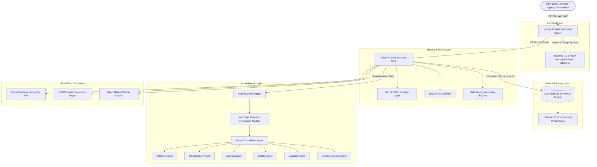

# 🏛️ ReliefGrid System Architecture Diagram

## 📌 Technical Component Flow

---

## 📌 Data Interaction Lifecycle

1. **Operator Action**: Operator inputs an incident report via the Next.js frontend.
2. **FastAPI Gateway**: Sanitizes payload using Pydantic v2 and validates JWT permissions.
3. **CockroachDB Vector Retrieval**: Queries nearest 1024-dimensional memory embeddings matching crisis parameters.
4. **AWS Bedrock Inference**: Master Coordinator Agent delegates prompt context + CockroachDB memories to Specialist Agents.
5. **GIS Path Generation**: OSRM API computes route geometry avoiding hazard polygons.
6. **Execution Output**: Action plan rendered live on the Command Center timeline.
